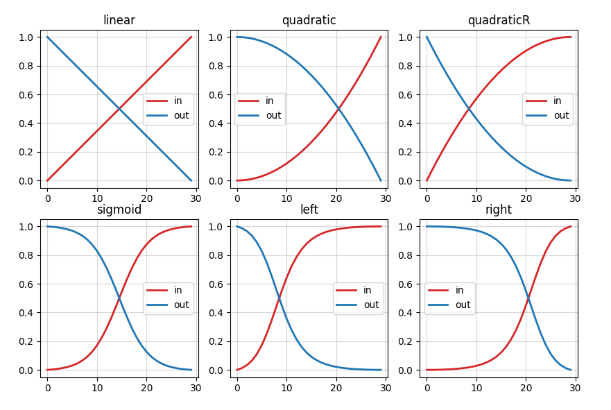
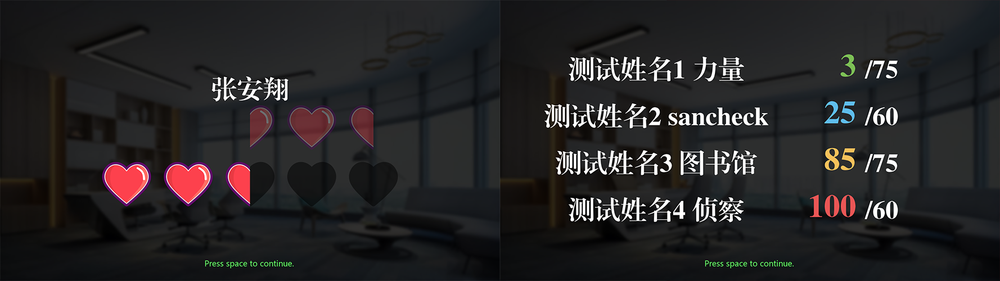
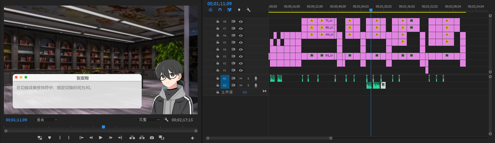
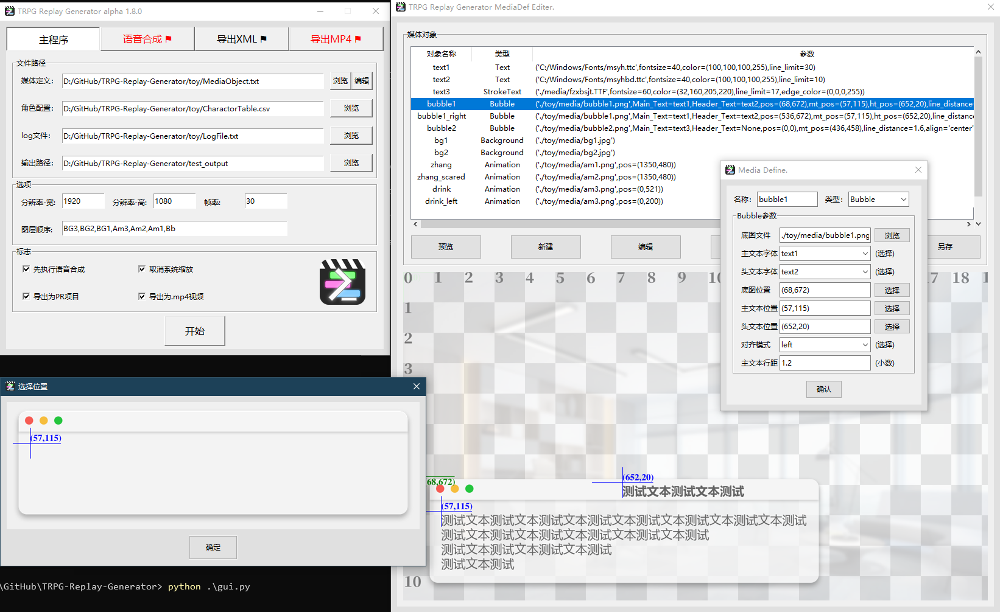
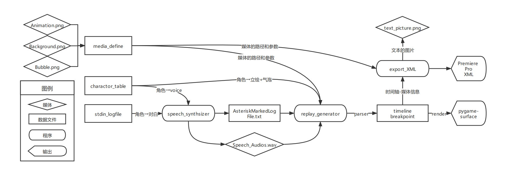

# 概述


回声工坊（TRPG-Replay-Generator）是一基于python3 和pygame 的自动replay视频制作工具，旨在替代replay视频和类视觉小说视频制作中的重复工作，显著提升效率。本工具包括主程序、语音合成、导出为PR项目、导出为视频等四个模块；本程序通过文本化编辑完成视频制作，在最大化效率的同时提供了较大的自定义空间，同时也提供了易用的图形化界面。无论是编程和文本处理的熟手，还是视频制作的新手，都可以轻松上手本程序。<br>

## 环境要求：

**运行主程序replay_generator所必要的：**
1. python &gt;= 3.8.3
2. [pygame](https://github.com/pygame/pygame) &gt;= 2.0.1
3. [numpy](https://github.com/numpy/numpy) &gt;= 1.18.5
4. [pandas](https://github.com/pandas-dev/pandas) &gt;= 1.0.5
5. openpyxl &gt;= 3.0.4

**若要导出为Premiere Pro XML 文件，额外要求：**
1. [Pillow](https://github.com/python-pillow/Pillow) &gt;= 7.2.0

**若要导出为 MP4 视频，额外要求：**
1. [ffmpeg-python](https://github.com/kkroening/ffmpeg-python) &gt;= 0.2.0
2. [pydub](https://github.com/jiaaro/pydub) &gt;= 0.25.1
3. 下载[ffmpeg](https://ffmpeg.org/download.html)的可执行文件，并解压到本程序根目录。

**若使用语音合成模块，额外要求：**
1. 安装[阿里云智能语音服务Python SDK](https://github.com/aliyun/alibabacloud-nls-python-sdk)
2. 查看[帮助文档](https://help.aliyun.com/document_detail/374323.html)
3. 获得[阿里云AccessKey、AccessKey_Secret、Appkey](https://ram.console.aliyun.com/manage/ak)

## 快速上手

### 1. 使用源码release

1. 下载源代码的release压缩包，并解压；<br>
2. 确保python已经准确安装，然后在解压路径，使用终端运行下列命令，安装环境要求；<br>
```bash
pip install -r ./requirements.txt
```
3. 使用终端运行下列命令，即可开始放映示例项目；<br>
```bash
python ./replay_generator.py -l ./toy/LogFile.txt -d ./toy/MediaObject.txt -t ./toy/CharactorTable.csv
```
4. 进入程序后，按空格键（SPACE）开始播放，播放的过程中，按A键跳转到前一小节，D键跳转到后一小节，按空格暂停播放，ESC键终止播放并退出。

### 2. 使用可执行文件release

1. 下载可执行文件的release的压缩包，并解压；<br>
2. 运行 `TRPG-Replay-Generator-v1.0.0.exe` 打开图形界面；<br>
3. 在媒体定义栏输入 `./toy/MediaObject.txt` ，角色定义栏输入 `./toy/CharactorTable.csv` ，log文件栏输入 `./toy/LogFile.txt` ；<br>
4. 点击开始，即可开始放映示例项目；<br>
5. 进入程序后，按空格键（SPACE）开始播放，播放的过程中，按A键跳转到前一小节，D键跳转到后一小节，按空格暂停播放，ESC键终止播放并退出。

> 注意：可执行文件release无需安装python环境即可运行，但是在效能和稳定性上比运行源码略差。

# 参考文档（文档版本 version 1.0.0）

## 主程序replay_generator.py

**主程序的参数：**

1. **--LogFile, -l** ：必要参数，log文件的路径，文件格式要求详见 [文件格式.log文件](./README.md#3-log文件)；
2. **--MediaObjDefine, -d** ：必要参数，媒体定义文件的路径，文件格式要求参考 [文件格式.媒体定义文件](./README.md#1-媒体定义文件)；
3. **--CharacterTable, -t** ：必要参数，角色表文件的路径，格式为制表符分隔的数据表，或者Excel电子表格，包含至少Name、Subtype、Animation、Bubble4列；
4. ***--OutputPath, -o*** ：可选参数，输出文件的目录；如果输入了该标志，则项目的时间轴、断点文件、内建对象文件将输出到指定的目录，格式分别为timeline、breakpoint、bulitinmedia。如果指定了其他输出标志，相应的文件也将输出到指定的目录。

5. ***--FramePerSecond, -F*** ：可选参数，播放的帧率，单位是fps；默认值是30fps；
6. ***--Width, -W*** ：可选参数，窗体的宽；默认值是1920；
7. ***--Height, -H*** ：可选参数，窗体的高；默认值是1080；
8. ***--Zorder, -Z*** ：可选参数，渲染的图层顺序；通常不建议修改这个参数，除非必要。格式要求详见 [进阶使用.图层顺序](./README.md#--zorder-图层顺序)。

9. ***--AccessKey, -K*** ：可选参数，阿里云账号的AccessKey，执行语音合成时所必须的；
10. ***--AccessKeySecret, -S*** ：可选参数，阿里云账号的AccessKeySecret，执行语音合成时所必须的；
11. ***--Appkey, -A*** ：可选参数，阿里云语音合成应用的Appkey，执行语音合成时所必须的。
12. ***--Quality, -Q*** :可选参数，导出为mp4视频时的质量，即ffmpeg程序的crf值；取值范围为0-51，越小对应越高的视频质量，通常合理范围为18-28；默认值是24

13. ***--ExportXML*** ：可选标志，如果使用该标志，会输出一个能导入到PR的XML文件，以及其引用的一系列PNG图片到输出目录。
14. ***--ExportVideo*** ：可选标志，如果使用该标志，会导出一个和窗口中播放的内容完全一致的MP4视频。使用该标志则会跳过窗口播放。
15. ***--SynthesisAnyway*** ：可选标志，如果使用该标志，会对log文件中尚未处理的星标行进行语音合成；一系列WAV音频到会输出到输出目录。
16. ***--FixScreenZoom*** ：可选参数，仅在windows系统上生效。使用该标志以消除由于windows系统缩放倍率，而导致的窗体尺寸异常。

**主程序命令例子：**

```bash
python replay_generator.py -l LogFile.txt -d MediaDefine.txt -t CharactorTable.csv -F 30 --ExportVideo
```

### 1. 媒体定义文件

媒体定义文件用于定义项目中使用的媒体对象，及其引用的文件；媒体定义文件使用类似python类实例化的语法。<p>
目前版本中，可用的对象包括下列：


1.	**文本、描边文本 Text、StrokeText**
```python 
Text(fontfile='./media/SourceHanSansCN-Regular.otf',fontsize=40,color=(0,0,0,255),line_limit=20)
StrokeText(fontfile='./media/SourceHanSansCN-Regular.otf',fontsize=40,color=(0,0,0,255),line_limit=20,edge_color=(255,255,255,255))
```

- 文本是气泡对象的一部分，无法单独使用；
- `fontfile`	可选参数，指定一个字体文件的路径；默认参数是 思源黑体-regular；
- `fontsize`	可选参数，设置字体的字号，合理的参数是大于0的整数；默认为40；
- `color`	可选参数，设置字体的颜色，是一个4元素的tuple，对应(R,G,B,A)，四个元素应为0-255的整数；默认值是黑色；
- `line_limit`	可选参数，设置单行显示的字符数量上限，超过上限会触发自动换行；默认为20字；
- `edge_color`	可选参数，设置字体的描边颜色，仅描边文本可用，是一个4元素的tuple，对应(R,G,B,A)，四个元素应为0-255的整数；默认值是白色。

> 注意：由于气泡对象需要引用文本对象，因此，文本对象在媒体定义文件中的位置必须在气泡对象的定义之前！。

2.	**气泡 Bubble**
```python
Bubble(filepath,Main_Text=Text(),Header_Text=None,pos=(0,0),mt_pos=(0,0),ht_pos=(0,0),align='left',line_distance=1.5)
```

- 气泡是一个文本框，在角色发言时显示，包含了主文本、头文本、底图三个组成部分。
- `filepath`	必要参数，指定一个图片文件的路径；即使不需要底图，也需要指定一个空白底图的路径；
- `Main_Text`	可选参数，为主文本指定一个Text或者StrokeText类的变量；主文本对应中的 *发言文本*；默认值是默认参数的Text对象，也可以设置为None；
- `Header_Text`	可选参数，为头文本指定一个Text或者StrokeText类的变量；头文本对应发言者的角色名；默认为None，既无头文本；
- `pos`	可选参数，设置气泡在屏幕上的位置，是一个2元素的tuple，对应(X,Y)；默认为(0,0)，即左上角；
- `mt_pos`	可选参数，设置主文本相对于气泡底图的位置，是一个2元素的tuple，对应(X,Y)；默认为(0,0)，即左上角；
- `ht_pos`	可选参数，设置头文本相对于气泡底图的位置，是一个2元素的tuple，对应(X,Y)；默认为(0,0)，即左上角；
- `align`	可选参数，设置主文本的对齐模式，可选项有`"left"`、`"center"`，分别对应左侧对齐和居中对齐；默认为左侧对齐；
- `line_distance`	可选参数，设置了多行显示时的行距，默认值为1.5倍行距。

3.	**背景 Background**
```python
Background(filepath,pos=(0,0))
```

- 背景指整个屏幕的背景，通常位于最下的图层，可以在log文件中的 *背景行* 中设置背景及其切换效果
- `filepath`	必要参数，指定一个图片文件的路径，或者指定`{'black','white','greenscreen'}`中的一个。
- `pos`	可选参数，指定了背景在屏幕上的位置，是一个2元素的tuple，对应(X,Y)，默认为(0,0)，即左上角。

> 注意：由于背景图通常都是全屏的图片，因此不建议修改Background的pos的默认值。

4.	**立绘 Animation**
```python
Animation(filepath,pos=(0,0),tick=1,loop=True)
```

- 立绘指和角色绑定的个人形象图片或动画，通常位于背景的上层，气泡的下层。
- `filepath`	必要参数，指定一个图片文件的路径；或通过通配符指定一系列顺序命名的图片文件的路径，以设置为动态立绘。
- `pos`	可选参数，指定了立绘在屏幕上的位置，是一个2元素的tuple，对应(X,Y)，默认为(0,0)，即左上角。
- `tick`	可选参数，仅在动态立绘中生效，设置立绘动画的拍率，单位为 帧/拍；默认为1，即一拍一。
- `loop`	可选参数，仅在动态立绘中生效，设置立绘动画是否循环播放，可以是`True`或者`False`，设置为否时，当动态立绘的完整播放了一次之后，会停留在最后帧；默认是`True`，即循环播放。

> 注意：一个角色可以在不同的subtype下指定不同的立绘，用于实现差分效果；使用时在log文件的对话行里指定到不同的subtype。<p>
> 注意：如果希望实现多人同框效果，建议为同框时的立绘另外建立Animation对象，并在定义时指定合适的位置。<p>
> 注意：在路径中使用符号`*`代表匹配任意字符；建议以位数相同的数字命名动态立绘。例如test_000.png、test_001.png。

5.	**背景音乐 BGM**
```python
BGM(filepath,volume=100,loop=True)
```

- BGM指长的，一直位于后台循环播放的音频；支持的格式是 .ogg ，如果是 .mp3 格式的背景音乐，建议先进行格式转换。
- `filepath`	必要参数，指定一个音频文件的路径。
- `volume`	可选参数，设置背景音乐的音量，合理的参数是0-100的整数；默认为100；
- `loop`	可选参数，设置背景音乐是否会循环播放；默认为循环播放；如果需要不循环，设置为`False`；

> 注意：BGM建议使用.ogg格式的音频，否则有可能出现程序的不稳定。另外，建议在后期制作软件中手动加入BGM。<p>
> 注意：BGM和audio的逻辑不同，不可混用！

6.	**音效 Audio**
```python
Audio(filepath)
```

- 音效指短音频，音效通常只会完整地播放一次。
- `filepath`	必要参数，指定一个音频文件的路径。

> 注意：replay视频中通常包含大量的语音文件，不建议全建立Audio对象，会消耗较大的内存，在Log文件的 *对话行* 的 *音效框* 里指定文件路径即可。<p>
> 注意：本文提及的 *文件路径* 的格式均为字符串，即需要引号引起来。例子：`"./pic/zhang.png"`<p>
> 注意：定义的媒体的变量名需要符合python变量名标准，且不可以和部分程序代码中已占用的关键字（详见[已占用关键字](./media/occupied_variable_name.list)）相互相互重合。

**媒体定义文件例子：**<p>
参考[示例媒体定义文件](./toy/MediaObject.txt)

### 2. 角色设置文件

角色设置文件是一个制表符`'\t'`分隔的数据表文件，或者Excel电子表格，用于配置角色和 *立绘、气泡、声音* 等媒体对象的对应关系；用于replay_generator主程序的角色设置文件需要至少包括 `Name、Subtype、Animation、Bubble` 四列；用于speech_synthesizer程序的角色设置文件需要至少包括 `Name、Subtype、Voice` 三列，`SpeechRate、PitchRate` 两列是可选的。

- Name列，角色的名称，和 *Log文件-对话行-角色框* 内的名称相互对应；名称可以包含英文字符，空格，数字，下划线，中文，不可以包含任何其他字符。
- Subtype列，角色的差分名称；差分名称可以包含英文字符，数字，下划线，中文，不可以包含空格；每个Name必须要有一个Subtype是default，且不可以有重复的Subtype。
- Animation列，角色立绘对象；需要是 *媒体定义文件* 中已经定义的Animation类的变量名，或者使用 NA 表示缺省。
- Bubble列，发言气泡对象；需要是 *媒体定义文件* 中已定义的Bubble类的变量名，或者使用 NA 表示缺省。
- Voice列，角色配音的音源名；所有可选的Voice详见[可用的语音](./doc/aliyun_available_voice.md)；不需要语音的角色使用 NA 表示缺省。
- SpeechRate列，角色配音的语速；取值范围是(-500,500)，对应0.5倍速至2倍速。
- PitchRate列，角色配音的语调；取值范围是(-500,500)，对应低八度至高八度。详见[接口说明](https://help.aliyun.com/document_detail/84435.html)

角色设置文件例子：

|Name|Subtype|Animation|Bubble|Voice|SpeechRate|PitchRate|
|:---|:---:|:---:|:---:|:---:|:---:|:---:|
|张安翔|default|zhang|bubble1|sicheng|50|0|
|张安翔|scared|zhang_scared|bubble1|sicheng|30|0|
|KP|default|drink|bubble2|sijia|50|0|
|旁白|default|NA|bubble2|NA|NA|NA|

> 注意：骰子、旁白等弹窗型气泡，也可以以“角色”的形式定义在本文件中。<p>
> 注意：缺失Bubble的角色不可以作为发言行的主发言人。

### 3. Log文件
log文件是整个演示的剧本文件，决定了演示的内容和效果；<p>
log文件有4类有效行，对话行，背景行，设置行和内建动画行，分别有其对应的格式。

#### A. 对话行
```
[name1(100).default,name2(60).default,name3(60).default]<replace=0>:Talk#Text.<all=0>{"./audio/1.ogg";30}{Audio;*30}
```

通过对话行，在演示中展示角色的 *立绘* ，并用相应的 *气泡* 显示 *发言文本* 中的文字。对应关系在 *角色设置文件* 中定义。

1.	**角色框：**`[name(alpha).subtype;...]`
	- 角色框内最多指定 3 个角色，同框角色的立绘都将展示出来；
	- 只有顺位第一个角色的立绘的透明度为100，其余角色会自动被设置为半透明，在角色名后使用(alpha)可以手动指定立绘的透明度；
	- 同一个角色如果有差分，可以在角色名后使用.subtype来指定差分；未指定的将默认使用.default。
2.	**切换效果修饰符：**`<method=time>`
	- 目前所有可用的切换效果（method）参考 [动态切换效果](./README.md#4-动态切换效果) 小节；
	- 若语句中未指定切换效果，则立绘的切换效果使用 *am_method_default*，气泡的切换效果时使用 *bb_method_default*；
	- 切换时长（time）指渐变持续的帧数；可以缺省持续时长，此时立绘的切换时长将使用 *am_dur_default* ，气泡的切换时长将使用 *bb_dur_default*；
3.	**发言文本：**`^Talk#Text`
	- 发言文本可以是大部分文本，但不能包括英文双引号`""`和反斜杠`\`；不建议包括英文方括号`[]`、英文尖括号`<>`和英文花括号`{}`，否则可能导致程序的不稳定或报错；
	- 发言文本中使用井号 `#` 作为手动换行符，或在句首使用 `^` 声明手动换行模式；在手动指定换行符的行内，自动换行是失效。
4.	**文本效果修饰符：**`<method=time>`
	- 目前可用的文本展示的效果（method）有 `all，w2w，l2l` ，分别对应：显示所有文本，逐字显示文本，逐行显示文本；
	- 若语句中未指定展示效果，则文本效果使用 *tx_method_default*；
	- 单位时间（time）指每显示一个字需要的帧数；可以缺省单位时间，此时单位时间将使用 *tx_dur_default*；
	- `all`，一次性展示所有文本，time此时指延迟帧数；
	- `w2w`，逐字展示文本；
	- `l2l`，逐行展示文本。
5.	**音效框：**`{file_or_obj;*time}`
	- 音效（file_or_obj）可以指定一个Audio对象，或者一个文件的路径，或者使用NA表示缺省；
	- 延迟时间（time）指这个音效相对于本小节第一帧所延迟的帧数；
	- 一个对话行可以有多个音效框；
	- 若在音效框的time数值前添加星号 `*` ，则本小节的总时长将受到星标时间的控制。总时长 = time + asterisk_pause。

> 注意：在角色名后使用(alpha)指定透明度时，不可以设置为100，这样是无效的。设置为99即可。
> 注意：在使用 `#` 进行手动换行的句子里，如果第一行长度超过line_limit，在 `<w2w>` 模式仍会自动换行，直到第一个 `#` 被触发为止。为了避免这种情况的发生，在句首声明 `^`。<p>
> 注意：当文本展示效果为 `<all>` 时，单位时间指显示的延迟帧数。<p>
> 注意：星标音频的单位是秒，而非帧；星标的音效通常由 *speech_synthesizer.py* 自动生成。请谨慎地手动设置星标音效。


**对话行例子：**
```
[张安翔]:最基本的对话行
[张安翔]<black>:指定了切换方式
[张安翔]<black=30>:指定了切换时间
[张安翔]<black=30>:指定了文字显示模式<w2w>
[张安翔]<black=30>:指定了文字显示单位时间<w2w=5>
[张安翔,KP]<black=30>:设置了多人同框<w2w=5>
[张安翔(60),KP(30)]<black=30>:手动设置了立绘透明度<w2w=5>
[张安翔(60).scared,KP(30)]<black=30>:显示角色的差分立绘<w2w=5>
[张安翔(60).scared,KP(30)]<black=30>:设置手动换行模式#以井号作为换行符#逐行显示内容<l2l=5>
[张安翔(60).scared,KP(30)]<black=30>:播放语音<all=5>{'./voice/1.ogg'}
[张安翔(60).scared,KP(30)]<black=30>:播放音效<all=5>{SE1;*30}
```

#### B. 背景行
```
<background><replace=0>:Background
```

通过背景行，切换播放的背景图片。
1.	**背景行的识别标志：**`<background>` 是背景行的必要组成部分。
2.	**切换效果修饰符：**`<method=time>` 背景切换效果（method）包括：
	- `cross`：交叉溶解，新的背景会逐渐覆盖原背景，参数是整个渐变的时长
	- `black`：黑场，原背景先隐入黑场，然后新背景再逐渐出现，参数是整个渐变的时长。
	- `white`：白场，原背景先隐入白场，然后新背景再逐渐出现，参数是整个渐变的时长。
	- `replace`：替换，瞬间替换，参数是替换发生后的停顿时间。默认值是replace=0。
	- `delay`：延时，延后替换，参数是替换发生前的延迟时间。
	- `push`：推，新立绘从右侧进入画面，将旧立绘推出画面，参数是整个动画的持续时间。
	- `cover`：覆盖，新立绘从右侧进入画面，覆盖在旧立绘上层，参数是整个动画的持续时间。
3.	若语句中未指定切换效果，切换效果使用 *bg_method_default*；
4.	可以缺省持续时长，此时切换时长使用 *bg_dur_default*；

**背景行例子：**
```
<background>:BG1
<background><cover>:BG2
<background><black=30>:BG3
```

#### C. 设置行
```
<set:am_method_default>:<replace=0>
```

通过设置行，动态地改变全局变量；
set:后跟需要设置的全局变量名；
可以通过set动态修改的全局变量有：
1.	`am_method_default`：立绘的默认切换方法，初始值是：`<replace=0>`。
	- 当对话行中缺省 *切换效果修饰符* 时，则使用该默认值；
	- 可用的选项参考 [动态切换效果](./README.md#4-动态切换效果)。
2.	`am_dur_default`：默认切换时间，初始值是：10，单位是帧。
	- 当对话行的 *切换效果修饰符* 中未指定时间，则使用该默认值；
	- 例如 `<replace>`，等价于`<replace=10>`
3.	`bb_method_default`：气泡的默认切换方法，初始值是：`<replace=0>`。
	- 当对话行中缺省 *切换效果修饰符* 时，则使用该默认值；
	- 可用的选项参考 [动态切换效果](./README.md#4-动态切换效果)。
4.	`bb_dur_default`：默认切换时间，初始值是：10，单位是帧。
	- 当对话行的 *切换效果修饰符* 中未指定时间，则使用该默认值；
	- 例如 `<replace>`，等价于`<replace=10>`
5.	`bg_method_default`：默认展示方法，初始值是：`<replace=0>`。
	- 当背景行中缺省 *切换效果修饰符* 时，则使用该默认值；
	- 可用的选项有 `cross、black、white、replace、delay、push、cover`。
6.	`bg_dur_default`：默认展示时间，初始值是：10，单位是帧。
	- 当背景行的 *切换效果修饰符* 中未指定时间，则使用该默认值
	- 例如 `<replace>`，等价于`<replace=10>`
7.	`tx_method_default`：默认文本展示方法，初始值是：`<all=1>`。
	- 当对话行中缺省 *文本效果修饰符* 时，使用该默认值
	- 可选的选项有 `all、w2w、l2l`；
	- 例如 `[name]:talk` ，等价于 `[name]<replace=0>:talk<all=1>`
8.	`tx_dur_default`：默认文本展示时间，初始值是：8，单位是帧。
	- 当对话行的`<文本效果修饰符>`中未指定时间，则使用该默认值；
	- 例如 `<l2l>`，等价于 `<l2l=8>`。
9.	`speech_speed`：语速，初始值是：220，单位是 words/min。
	- 语速将影响每个小节的持续时间，当小节没有指定星标音频的时候。
10.	`asterisk_pause`：星标音频的间隔时间，初始值是：20，单位是帧。
	- asterisk_pause 仅能通过 *设置行* 进行设置，会应用于之后所有的星标音频。
11.	`BGM`：背景音乐
	- 使用`<set:BGM>`: 设置背景音乐时，需要指定一个BGM对象，或一个.ogg音频文件的路径；
	- `<set:BGM>:stop` 可以终止背景音乐的播放。
	- 背景音乐的设置在下一个 *对话行* 或 *内建动画行* 的第一帧生效。
12.	`formula`：切换效果的曲线函数，初始值是：linear，即线性。
	- 目前可用的formula包括 `linear(线性)、quadratic(二次)、quadraticR(二次反向)、sigmoid(S型)、sincurve(正弦)、left(左锋)和right(右峰)`；
	- formula可以接受 lambda函数 形式定义的自定义函数，自定义函数需要以 `(begin,end,duration)` 为参数；
	- formula仅能通过 *设置行* 进行设置，会应用于之后所有的切换效果。



> 注意：使用非.ogg文件作为背景音乐，可能导致程序的不稳定，或者卡死！

**设置行例子：**
```
<set:bg_method_default>:<black=30>
<set:tx_dur_default>:10
<set:BGM>:'./BGM/test.ogg'
<set:BGM>:BGM1
<set:formula>:sigmoid
<set:formula>:lambda begin,end,duration:np.linspace(end,begin,duration)
```

#### D. 内建动画行
```
<hitpoint>:(张安翔,10,7,4)
<dice>:(describe,100,50,36),(describe,20,NA,14)
```

目前支持的内建动画包括生命值损失、恢复动画，滚动式骰子动画。



##### a. 生命值 <hitpoint>:(name,max,begin,end)

1.	使用生命值动画的标志：`<hitpoint>:`
2.	括号内的参数，按顺序分别是：显示的文字，总生命值，变化前的生命值，变化后的生命值；
3.	生命值动画仅可输入一组参数。

##### b. 骰子 <dice>:(describe,dice,check,face),...

1.	使用骰子动画的标志：`<dice>:`
2.	括号内的参数，按顺序分别是：骰子描述，骰子的面数，检定值，出目；
3.	当指定检定值之后，当出目小于等于检定值，大于检定值，小于等于骰子面数的5%，大于骰子面数的95%，将分别被着色为蓝色，橙色，绿色，红色；
4.	检定值可使用NA表示缺省。当检定值缺省时，出目将着色为白色。
5.	骰子动画最多可输入四组参数，组与组之间可使用逗号分隔。输出超过4组参数，则仅保留前4组参数。

#### E. 注释行、空白行
```
#annotation
```
1.	当一个行的第一个字符是井号`#`，则这个行被认作为注释，行内的任何内容都不会被执行；
2.	log文件可以任意地添加空白行，且不会影响程序的正常使用。

### 4. 动态切换效果

在alpha 1.7.0版本之后，添加了大量了适用于立绘和气泡的动态切换效果，可用轻松的构建灵动的画面和各具功能性的气泡；<p>
在对话行中的切换效果修饰符中可用设置切换效果，或者通过 `am_method_default、bb_method_default` 设置全局的切换效果；<p>
一个合法的method需要包含下列5类关键字中的至少一个，多个关键字之间使用下划线 `_` 连接：

1.	`replace, delay, black`: 透明度变化，分别对应：瞬间出现（默认值），延后出现，淡入淡出；
2.	`static, leap, pass, circular`: 切换动态，分别对应：静止（默认值），跳起，通过，圆周运动（实验功能）；
3.	`up, down, left, right, DG[int]` ：切入角度，分别对应：上（默认值），下，左，右，指定角度（12点方向的逆时针角度）；
4.	`major, minor, entire, [int]` ：运动尺度，分别对应：长距离（默认值），短距离，全屏水平，指定长度（像素）；
5.	`both, in, out` ：效果应用于，分别对应：双端（默认值），仅切入，仅切出。

**切换效果例子：**
```
<black_pass=30>
<replace=20>
<black_leap_minor_DG30=10>
<delay_right_circular_major=10>
<in_black_pass_up_major=30>
```

> 注意：当同一类关键字出现了多次时，将以最后一次为准；未出现的关键字类型则采用默认值。

## 语音合成模块speech_synthesizer.py

**语音合成模块的参数**

1. ***--Logfile, -l***
2. ***--MediaObjDefine, -d***
3. ***--CharacterTable, -t***
4. ***--OutputPath, -o*** ：必要参数，输出目录，合成的音频和处理后的log文件将会输出到这个路径。
5. ***--AccessKey, -K***
6. ***--AccessKeySecret, -S***
7. ***--Appkey, -A***

其余参数描述均和主程序一致，不再赘述。

**语音合成模块命令例子：**

```bash
python speech_synthesizer.py -l LogFile.txt -d MediaDefine.txt -t CharactorTable.csv -K *** -S *** -A *** -o ./test_output
```

### 1. 获取阿里云智能语音交互key

1. 注册并登录[阿里云智能语音服务控制台](https://nls-portal.console.aliyun.com/applist)
2. 创建项目，即可获取项目Appkey
3. 鼠标移动至右上角头像，进入下拉菜单，[AccessKey管理](https://ram.console.aliyun.com/manage/ak)
4. 点击创建AccessKey，即可获取AccessKey和AccessKeySecret
5. AccessKeySecret仅在创建时可见，务必记录；AccessKey和AccessKeySecret拥有账户的所有权限，请务必妥善保管，以免遭受意外损失！

### 2. 用于语音合成的Log文件

用于语音合成的log文件中，在 *对话行的音效框* 使用 *待处理星标* 表明需要执行语音合成；当主程序遭遇 *待处理星标* 时，会报出下列报错，并终止程序。

`[ParserError]: Unprocessed asterisk time label appeared in dialogue line *. Add --SynthesisAnyway may help.`

语音合成模块可以处理log文件中 *待处理星标* ，并将处理完毕的log文件以 `AsteriskMarkedLogFile.txt` 为文件名，输出在指定的输出路径。
通常，很少需要手动调用语音合成模块，在主程序中指定标志 `--SynthesisAnyway` ，即可在执行主程序之前，先执行语音合成并处理妥当log文件。

#### 待处理星标的格式

1. `{*}` ：待语音合成的标志，将本对话行的全部发言文本执行语音合成；
2. `{*speech_text}` ：合成指定文本的语音，而使用对话行的发言文本；
3. `{"./media/voice.wav",*}` ：当需要使用外部音频，而非语音合成时，可以读取音频文件持续时间，并填补到星标之后；这可以使小节的时长和音频时长同步。

待处理log文件例子:
```
[张安翔]:阿里云语音合成。{*}
[张安翔]:指定语音合成内容。{*将这一段文字合成为语音}
[张安翔]:使用现成的音频文件。{'./media/voice.wav',*}
```

> 注意：若语音合成为未成功执行，则待处理的星标音频将不会被更改。<p>
> 注意：若*角色配置表*中，某角色缺省Voice，则无法正常合成！<p>
> 注意：如果在语音合成过程中，由于网络等问题导致合成中断，已合成的星标将被替换，未合成的星标将被保留。将此时输出的AsteriskMarkedLogFile.txt重新输入语音合成程序，即可从上一次断点继续合成。

## 导出PRXML模块export_xml.py

**导出PRXML模块的参数:**

1. ***--TimeLine, -l*** ：必要参数，timeline文件的路径，timeline文件主程序生成在输出路径的工程文件；
2. ***--MediaObjDefine, -d***
3. ***--CharacterTable, -t*** : 无效参数，导出PRXML模块，导出视频模块不需要角色配置表；
4. ***--OutputPath, -o*** ：必要参数，输出文件的目录，媒体的图片和XML项目将输出到这个路径。
5. ***--FramePerSecond, -F***
6. ***--Width, -W***
7. ***--Height, -H***
8. ***--Zorder, -Z***

其余参数的描述和主程序一致，不再赘述。

**导出PRXML模块命令例子：**

```bash
python export_xml.py -l 12345.timeline -d MediaDefine.txt -o ./test_output -F 60
```

### 导出PRXML模块的注意事项

1. 单独使用导出PRXML模块时，FramePerSecond、Width、Height、Zorder等参数，建议和主程序生成timeline文件时使用的参数相一致，以免出现不稳定的表现。
2. 发言文本，内建动画等将以png图片的格式输出到指定的输出目录，文件的量可能较大，建议指定一个空白文件夹为输出目录。
3. 导出的XML项目将和输入的timeline文件同名。



## 导出视频模块export_video.py

**导出视频模块参数**

1. ***--TimeLine, -l***
2. ***--MediaObjDefine, -d***
3. ***--CharacterTable, -t***
4. ***--OutputPath, -o*** ：必要参数，输出文件的目录，导出的视频和混音音轨将输出到这个路径。
5. ***--FramePerSecond, -F***
6. ***--Width, -W***
7. ***--Height, -H***
8. ***--Zorder, -Z***
9. ***--Quality, -Q***

--Timeline、--CharacterTable和导出PRXML模块一致，其余参数的描述和主程序一致，不再赘述。

**导出视频模块命令例子：**

```bash
python export_video.py -l 12345.timeline -d MediaDefine.txt -Q 21
```

### 导出视频模块的注意事项

1. 单独使用导出PRXML模块时，FramePerSecond、Width、Height、Zorder等参数，建议和主程序生成timeline文件时使用的参数相一致，以免出现视频和预览不一致的情况。
2. 项目导出为视频时，如果包含较多的动态帧，例如动态切换效果，动画立绘，内建动画效果等，可能会减慢导出速度。通常而言，平均导出速度不低于30fps。
3. 使用 `--Quality` 指定导出视频质量时，通常18即代表极好的视频质量；Quality指定过小的值会导致输出文件巨大！
4. 导出的mp4视频和mp3音频和输入的timeline文件同名。
5. 需要将ffmpeg的两个可执行文件 ffmepg.exe、ffprob.exe 和 export_video.py 置于同一个路径下。

## 图形界面gui.py

**使用**
```bash
python gui.py
```

出于易用性的考虑，使用图形界面将上述四个模块包装。



# 进阶使用



## 修改timeline和breakpoint文件
- timeline, breakpoint, bulitinmedia 文件是主程序输出的文件集合，三个同名的文件为一组，包含了整个工程的画面和音频的时间轴信息。
- timeline文件是主程序的 `parser()` 函数解析log文件之后，生成 `render_timeline` 的表格，提供给 `render()` 函数逐帧渲染；
- breakpoint文件记录了各个小节的断点，用于在播放过程中向前向后导航，或在导出为XML时分隔clip；
- bulitinmedia文件记录了非用户定义的内建媒体，用于在不同模块之间传递；
- 因此，熟悉pandas库的使用者可以自行修改timeline，以实现到高度自定义的显示效果。
- timeline 的type是 `pandas.DataFrame`，breakpoint和bulitinmedia的type是 `pandas.Series`；使用`pandas.read_pickle(filepath)`可以读取这些文件。
- `timeline.columns`为：

|BG123|BG123_a|Am123|Am123_a|Am123_p|Am123_t|Bb|Bb_main|Bb_header|Bb_a|Bb_p|BGM|Voice|SE|
|---|---|---|---|---|---|---|---|---|---|---|---|---|---|

- 分别表示：三层背景图层及其透明度(a)，三个立绘图层及其透明度(a)、相对归零点的位置(p)、动画帧(t)，一个气泡图层及其主文本(main)、头文本(header)、透明度(a)、相对位置(p)，背景音乐，语音，音效。
- `timeline.index`为帧序号。出于节约性能的考虑，与前一帧相同的帧被舍弃且不重复渲染，因此`timeline.index`是不连续的。
- `breakpoint.index`为原始log文件中的行，`breakpoint.values`为各个断点对应的帧序号。
- `builtinmedia.index`为内建媒体的标识符，`builtinmedia.values`是记录的每个内建媒体的定义命令。

## --Zorder 图层顺序
- 修改图层顺序参数，可以改变各个图层的重叠关系。
- 默认的图层顺序为`-Z "BG3,BG2,BG1,Am3,Am2,Am1,Bb"`，顺序为从下到上，即*背景*在最下层，*气泡*在最上层，*立绘*在中间，其中主立绘在其他立绘上层。
- 主要的修改需求可能是要求立绘覆盖在气泡的上层，因此，可以将 *--Zorder* 参数设置为`"-Z BG3,BG2,BG1,Bb,Am3,Am2,Am1"`

> 注意：不建议修改3个BG图层的顺序，否则会导致多个切换效果的不正常表现！
