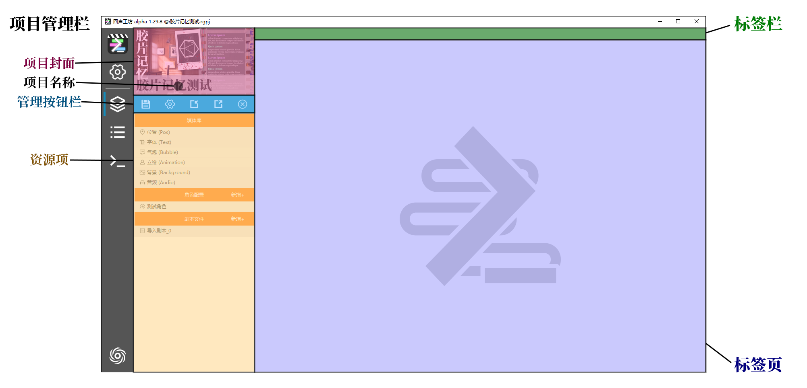
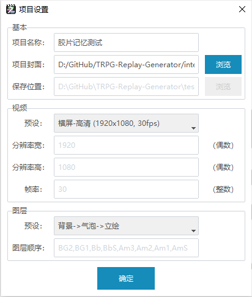
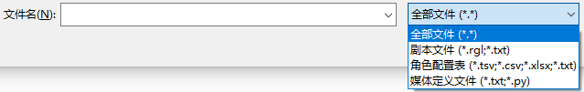
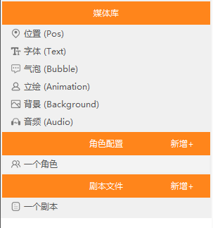

# 项目管理

“项目”是制作replay视频的最主要的场所，项目中会包含项目所有使用到的媒体素材、角色、剧本等资源。本小节主要介绍项目视图的主要构成部分，以及如何管理一个项目。

`项目视图` 由以下几个部分构成：

1. 位于左侧的 `项目管理栏`
2. 位于右侧顶部的 `标签栏`
3. 位于右侧主要区域的 `标签页`

## 1. 项目管理栏

`项目管理栏` 是位于 `项目视图` 左侧恒定宽度的区域，主要用途是以 `条目` 为单位管理项目所涉及的资源。`项目管理栏` 从上至下包含：

1. 项目封面
2. 项目名称
3. `管理按钮栏`
4. `资源项`

### 1.1 项目封面和项目标题

项目封面和项目标题由用户自行设置，主要意义是便于识别和美化项目，不影响项目的主要功能。设置封面和标题的方法有下列2种：

1. 在新建项目时即可设置项目封面和项目标题，详见 [新建项目](./B-01-02.md/#1-新建空白项目)；
2. 进入 `项目视图` 后，点击 `管理按钮栏` 中的【项目设置】按钮（齿轮图标），即可设置封面和标题。

> 注意：在新建项目时，创建项目文件夹和项目文件的名称会和项目本身的名称一致；但是在建立项目后，允许将项目名称修改为其他文本。

### 1.2 管理按钮栏

管理案例栏是位于项目名称下方的一行5个按钮，从左至右分别为：

1. 保存项目，图标是：软盘
2. 项目设置，图标是：齿轮
3. 导入工程文件，图标是：箭头指向方框内
4. 导出工程文件，图标是：箭头指向方框外
5. 关闭项目，图标是：圆圈中包含一个叉

将鼠标停留在按钮上方，会弹出每个按钮对应的文字提示

#### 1.2.1 【保存项目】按钮

当用户修改了项目中的内容时，变更并不会直接同步到项目文件内。需要点击【保存项目】按钮，才会将项目的当前状态写入到文件。如果未保存变更就关闭项目或者关闭回声工坊软件，尚未保存的变更将会**永久地丢失！**

#### 1.2.2 【项目设置】按钮

项目设置仅对于当前项目有效，和软件的 `首选项` 不同。点击项目设置按钮后，会弹出项目设置窗口，该窗口和 `新建空白项目` 的窗口基本相同。项目设置主要包含：

1. 基本信息，如项目名称、标题
2. 视频参数，如分辨率，帧率
3. 图层顺序

具体参数已经在 [新建空白项目](./B-01-02.md/#1-新建空白项目) 里说明，这里不再赘述。修改完成之后，点击确认即可，修改的参数会立刻生效。

#### 1.2.3 【导入工程文件】按钮

导入文件按钮，用于向项目中导入`媒体定义文件`、`角色配置表`或`RGL剧本文件`。

点击【导入工程文件】按钮，即可浏览并选择所需要导入的文件。点击文件类型的下拉菜单，可以选择要导入的具体的文件类型。**可以一次性选择多个文件！**

导入文件后，会弹出消息窗，汇总统计本次导入文件，对于项目产生的变更。在 `资源项` 中也可以看到通过导入新加入的 `条目`。

> 注意1：导入文件的默认模式是：新增，即不会修改项目中已有的媒体。如果需要通过导入文件中的更新现有媒体和角色，需要修改：首选项-编辑设置-导入模式。详见 [首选项](./WIP.md)

> 注意2：只能导入上述3类工程文件，不可以使用【导入文件】按钮导入媒体素材！

#### 1.2.4 【导入工程文件】按钮

导入文件按钮，用于将项目中现有的全部内容，导出为`媒体定义文件`(txt)、`角色配置表`(tsv)和若干个`RGL剧本文件`(rgl)。

点击【导入工程文件】按钮，即可在磁盘中选择导出项目的位置以及导出文件的前缀名（默认为：导出文件）。确认导出之后，会在指定文件夹生成若干个以指定前缀名命名的文本文件。

#### 1.2.5 【关闭项目】按钮

关闭项目按钮，用于关闭当前打开的项目，回到 `项目视图` 首页。

### 1.3 资源项

`资源项` 是项目中最主要的组成部分。资源项被分为三类：

1. `媒体库`，即项目中需要使用到的图片、字体、音频等资源，固定包含6条的不同类型媒体的`条目`；
2. `角色配置`，管理剧本中出现的所有角色，每个角色对应一条`条目`；
3. `剧本文件`，每一集剧本对应一条`条目`。

点击资源项目中的任意一个条目，即可以 `标签页` 的形式打开这个`条目`。

点击`媒体库`、`角色配置`、`剧本文件`的标题栏区域，可以折叠或展开对应栏目的`条目`。

#### 1.3.1 媒体库

`媒体库`中存储了项目中所有使用的图片、字体、音频等媒体资源。值得一提的是，在项目中使用媒体素材，并不是在使用文件本身，而是基于素材文件创建的 `媒体对象`，`媒体库` 即分类存储 `媒体对象` 的库。关于 `媒体对象` 的具体说明，可以查阅 [管理媒体](./WIP.md)。

>注意：在项目管理栏中，媒体库的6个条目是固定且无法修改的。

#### 1.3.2 角色配置

角色配置，即需要管理并配置所有出现在剧本中出现的角色，为角色绑定`立绘`、`发言气泡框`、`语音音源` 等参数。

#### 1.3.2.1 创建角色

点击【角色配置】右侧的【新增+】按钮，即可新增一个角色。新增角色时需要用户输入一个合法的角色名，按【回车键】确定。关于角色名的规范，请查阅 [角色名格式要求](./WIP.md)

创建角色完成之后，点开角色对应的标签页，已经有一个默认的 `角色差分`。关于角色的其他具体配置，请查阅 [配置角色](./WIP.md)

#### 1.3.2.2 角色重命名

右键点击角色条目，会弹出右键菜单，选择【重命名】，即可重新设置角色名；按【回车键】确定；按【esc】键放弃更改。

#### 1.3.2.2 删除角色

在右键点击角色条目的菜单中选择【删除】，即可删除角色。

> 注意：删除角色条目的操作是无法撤销的！请谨慎地删除角色。

#### 1.3.3 剧本文件

剧本文件即视频的主要内容。剧本文件是导出的基本单位，即每一个剧本文件都能单独导出为一个视频文件或一个PR工程文件。

剧本文件条目的管理操作几乎和角色配置的操作相同，包含以下操作，这里不再赘述：

1. 点击【剧本文件】右侧的【新增+】，创建一个剧本。
2. 右键菜单点击【重命名】，重命名一个剧本。
3. 右键菜单点击【删除】，永久地移除一个剧本。

关于剧本内容的具体编辑方法，请查阅：[编辑剧本](./WIP.md)

# 2. 标签栏

每一个在 `资源项` 中打开的 `条目`，都会在标签栏中增加一个标签。通过标签栏，可以在多个打开的标签页之间切换显示。点击页标签最右侧的【x】按钮，即可关闭一个以及打开的标签页。

# 3. 标签页

点击打开媒体、角色、剧本三类不同的资源条目后，对应的标签页会有不同的排版和功能。具体详情可以分别查阅：

1. 媒体：[管理媒体](./WIP.md)
2. 角色：[配置角色](./WIP.md)
3. 剧本：[编辑剧本](./WIP.md)
