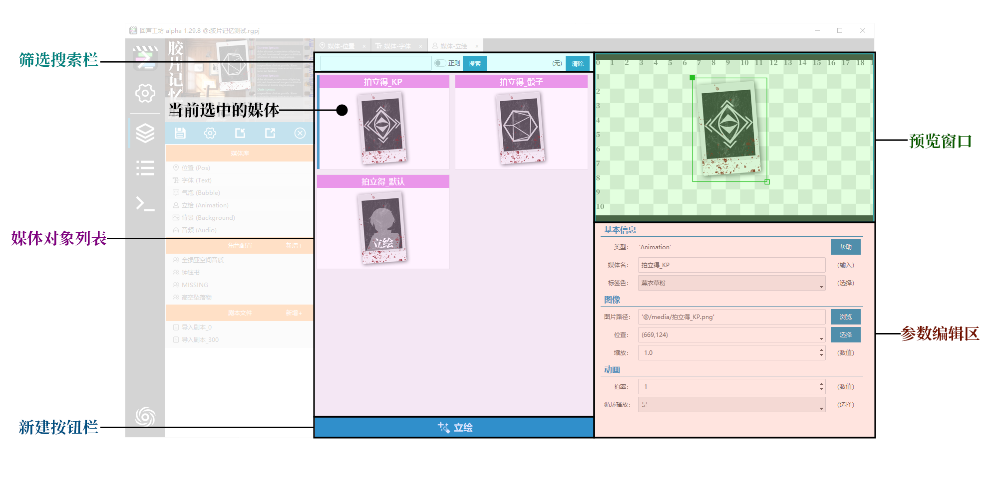
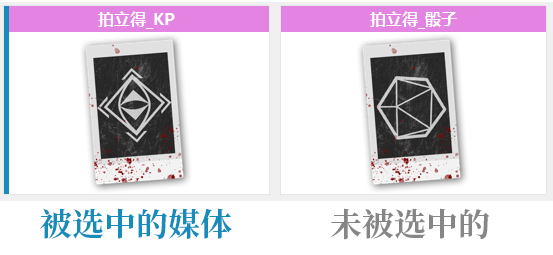
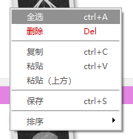
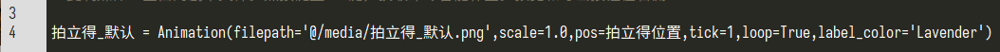
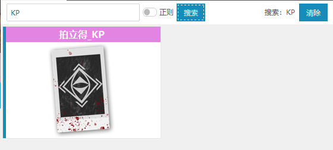
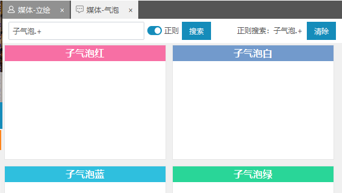

# 管理媒体

首先，我们需要引入一个概念，叫做 `媒体对象`。`媒体对象` 均存储在 `媒体库` 栏目下的标签页中。根据使用功能的不同，媒体被分为以下六个大类，分别对应 `媒体库` 中的一个 `条目`：

1. 位置（Pos）
2. 字体（Text）
3. 气泡（Bubble）
4. 立绘（Animation）
5. 背景（Background）
6. 音频（Audio）

## 1. 媒体对象的介绍

在回声工坊中，使用到的图片、音频、字体等素材，并不是使用素材文件本身，而是使用基于素材文件建立的 `媒体对象`。

`媒体对象` 不仅仅指素材文件本身，其还会包含了一系列的参数。以立绘媒体为例，我们除了需要指定一个图片文件以外，还需要设置图片在画面中的 `位置` 等参数。也就是说，即使是基于同一个图片创建的立绘媒体，如果摆放在画面中的不同位置，也应建立为2个不同的 `媒体对象` 。

在回声工坊中使用建立好的 `媒体对象` 时，都应该使用为 `媒体对象` 设置的 `媒体名`，而不是使用的素材文件的文件名！

## 2. 媒体标签页介绍

点开媒体库中的条目，即可打开对应条目的 `标签页`。媒体标签页中包含以下区域：

1. `筛选搜索栏`：用于这是搜索筛选条件
2. `媒体对象列表`：列出了媒体对象
3. `新建按钮栏`：新建媒体对象的按钮
4. `预览窗口`：预览媒体对象的效果的窗口
5. `参数编辑区`：编辑媒体对象参数的区域

## 3. 媒体对象操作

6大类媒体对象分别对应 `媒体库` 中的一个 `条目`，每个条目只是存储了不同类型的媒体对象，具体的页面布局和操作都是相同的。本小节不具体介绍各 `媒体类` 的具体用途和参数含义，主要以立绘为例，介绍如何操作和管理媒体对象。

关于 `媒体对象` 的参数的编辑方法，请查阅[编辑媒体对象](./WIP.md)

`媒体类` 的具体用途和参数含义请查阅 [媒体类的参数详解](./WIP.md)

### 3.1 创建媒体

`新建按钮栏` 中有若干个按钮，对应新建不同类型的媒体。

点击任一类型的新建按钮，即可建立一个对应类型的媒体；将鼠标悬浮在任一新建媒体按钮上，会显示对应类型媒体的简单介绍。

#### 3.1.1 新建单个媒体

使用 **鼠标左键** ，单击任一【新建媒体按钮】，即可建立一个对应类型的媒体。

新建的媒体默认以 `新建[类型名]` 命名，例如 `新建立绘`；如果该名字已经被占用，则会在默认的名字后面添加 `_new`。

新建的媒体采用默认参数，需要用户自行修改参数。

#### 3.1.2 批量创建媒体

使用 **鼠标右键** ，单击任一【新建媒体按钮】，会唤起文件浏览窗口；用户可以选择一个或者多个指定类型的文件，即可批量导入选中的文件，并建立媒体对象。

批量创建的媒体默认以文件名命名。例如导入 `角色立绘.png` 文件，媒体将被命名为 `角色立绘`。同理，如果该名字已经被占用，则会在默认的名字后面添加 `_new`。

新建的媒体除了 `文件路径` 采用选择导入文件以外，其余参数均采用默认参数，需要用户自行修改参数。

> 注意：Pos(位置) 标签页下的3个媒体类，因为不涉及素材文件，因此不支持批量创建。也就是说，右键点击【新建固定点】是无效的。

### 3.2 选择和预览媒体

#### 3.2.1 单项选择

使用 **鼠标左键** ，单击 `媒体对象列表` 中的任一媒体对象，即可选中并预览该 `媒体对象`。

当一个 `媒体对象` 被选中后：
1. 其图标右侧会显示一条彩色的竖线，这是被选中的标志；
2. `预览窗口` 中会显示该媒体对象的预览效果；
3. `参数编辑区` 中会显示该媒体对象的参数，并允许用户修改参数。

#### 3.2.2 多项选择

可以使用以下几个方法，多选媒体对象：

1. 使用键盘快捷键 【ctrl+A】，即可选中当前 `标签页` 中所有的媒体对象。
2. 鼠标右键单击 `媒体对象列表` 中的任一媒体对象，在右键菜单中点击【全选】，即可选中当前标签页中所有的媒体对象。
3. 按住键盘按键【ctrl】，即可使用鼠标右键逐个选中 `媒体对象列表` 中的媒体对象。
4. 按住键盘按键【shift】，点击 `媒体对象列表` 中的两个媒体对象，即可选中这两个媒体之间所有的媒体对象。

当同时选择了多个媒体的时候：
1. `预览窗口` 只会显示第一个被选中的媒体的预览效果；
2. 无法通过 `参数编辑区` 编辑媒体的参数。

### 3.3 复制和粘贴媒体

可以复制选中的媒体对象，并粘贴到指定的位置。

#### 3.3.1 复制

可以使用以下方法在 `媒体对象列表` 中复制 `媒体对象`：

1. 使用键盘快捷键 【ctrl+C】，即可将当前选中的 `媒体对象` 复制到剪贴板。
2. 鼠标右键单击想要复制的 `媒体对象`，在右键菜单中点击【复制】，即可将当前选中的`媒体对象`复制到剪贴板。

#### 3.3.2 粘贴为媒体对象

可以使用以下方法向 `媒体对象列表` 中粘贴 `媒体对象`：

1. 使用键盘快捷键 【ctrl+V】，即可把当前剪贴板中的 `媒体对象` ，粘贴到当前选中的`媒体对象`**之后**。
2. 鼠标右键单击想要粘贴的位置，在右键菜单中点击【粘贴】或者【粘贴（上方）】，即可把剪贴板中的`媒体对象`粘贴到当前选中的位置**之后**或者**之前**。

> 注意1：复制的媒体对象，会在原有的媒体名之后添加`_cp`，以避免重名。

> 注意2：不能把复制的媒体对象粘贴到不合理的位置！例如，复制一个立绘类媒体对象，不可以将其粘贴到气泡（Bubble）或者角色标签页下。

#### 3.3.3 粘贴为文本

复制了一个媒体对象之后，可以将媒体对象以文本的形式，粘贴到任何文本编辑器中；粘贴的文本符合回声工坊`媒体定义文件`格式标准。

### 3.4 媒体重命名

在媒体的 `参数编辑区` 的基本信息中，可以修改媒体对象的名称和标签色。

媒体对象命名的格式规范，具体可以查阅：[命名规范-媒体](./WIP.md)；修改媒体名之后，请点击回车键确认变更。

标签色是该媒体在 `媒体对象列表` 中显示的小图标的标签的颜色；这个颜色在导出PR项目时，会赋予给本媒体所对应的剪辑片段。使用标签色可以方便分组管理媒体对象，优化编辑体验。关于颜色标签的更多使用详情，请查阅 [颜色标签的进阶使用](./WIP.md)

>注意：当媒体名称发生变化后，会触发 `更名广播`；关于 `更名广播` 的详细信息，可以查阅 [更名广播](./WIP.md)。

### 3.5 媒体排序

在右键菜单中，选择【排序】，可以对 `媒体对象列表` 中的 `媒体对象` 按照多种条件，进行排序：

1. 按名称：即按照媒体名进行排序；
2. 按类型：即按照媒体类型进行排序，相同类型的媒体会排在一起；
3. 按颜色标签：即按照标签色进行排序，相同标签色的媒体会排在一起。

### 3.6 搜索筛选媒体

在 `筛选搜索栏` 中，可以使用根据搜索条件，筛选显示的媒体。

#### 3.6.1 搜索

在文本框中输入需要搜索的文字，点击搜索，即可启用搜索过滤器。此时`媒体对象列表`中只会显示符合筛选条件的`媒体对象`。

#### 3.6.2 正则搜索

在文本框中输入一个 `正则表达式` ，启用正则模式开关；点击搜索，即可按照正则表达式进行搜索过滤；此时`媒体对象列表`中只会显示符合筛选条件的`媒体对象`。

关于正则表达式的详细介绍，请查阅[正则表达式使用入门](./WIP.md)。

#### 3.6.3 清除过滤

点击 `筛选搜索栏` 最右侧的清除按钮，即可清空筛选条件。此时`媒体对象列表`会恢复原状，将显示全部的`媒体对象`。

### 3.7 删除媒体

可以使用以下方法在 `媒体对象列表` 中删除 `媒体对象`：

1. 使用键盘按键 【del】，即可将当前选中的 `媒体对象` 复制到剪贴板。
2. 鼠标右键单击想要删除的 `媒体对象`，在右键菜单中点击【删除】，即可删除将当前所有选中的`媒体对象`！

> 注意：删除媒体对象是无法撤销的操作，请谨慎地删除媒体对象！